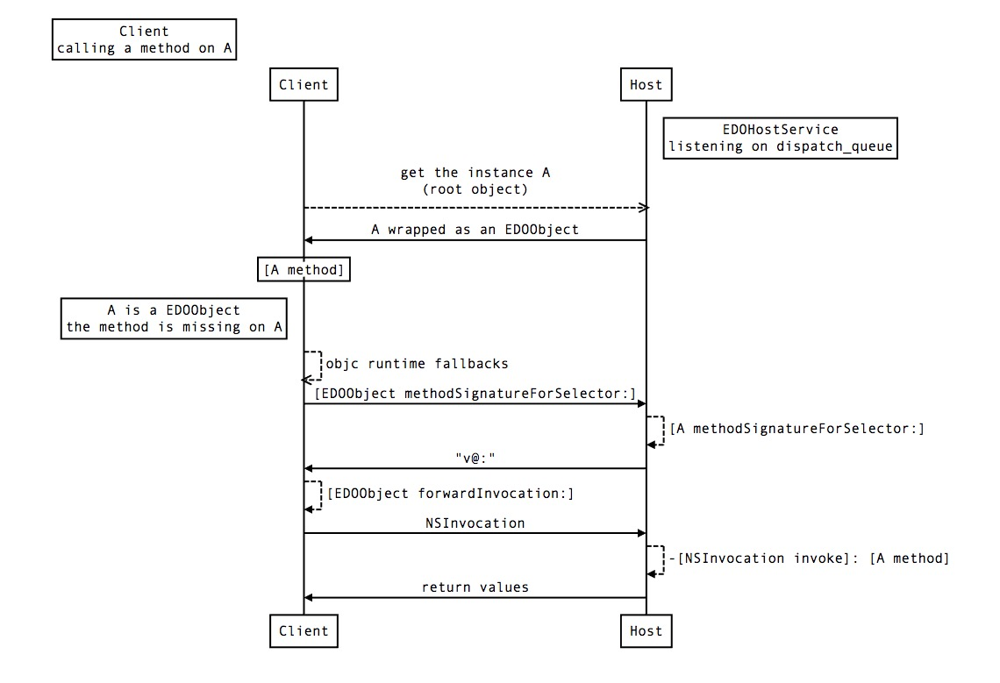

# eDO In Details

## The Remote Invocation

```objectivec
#import "ClassA.h"
#import "EDOClientService.h"

- (void)invokeRMI {
  ClassA *A = [EDOClientService rootObjectWithPort:HOST_PORT];
  [A method];
}
```

The following graph shows what happens when Client is invoking a `method` on an
instance `A` of class `ClassA`.



The instance `A`, of type `ClassA` as recognized by the compiler, is shadowed by
an instance of `EDOObject`, who points to the actual instance in `Host`.

The value types parameters or returns are coded and passed by copy, while the
other types are wrapped by another distant object and passed by ref. The errors
or exceptions will be populated from the remote process to the local process.

INET socket is used but UNIX domain socket can also be used while two apps have
the entitlements with the same group name to ensure the security. The data
being transferred can also be ciphered.

## The Service and its `dispatch_queue`

EDOHostService is used to serve as an instance, local to the process address as a
remote object that others can use. Once a EDOHostService is created, it will listen
on the given port number (if zero, it will pick any available port number from
the system) and execute the invocation in the given `dispatch_queue`. The
`dispatch_queue` will then hold a *strong* reference to the service. From this
point on, the EDOHostService is bound to that queue.

NOTE: There can only be one service that is associated with a `dispatch_queue`.
The newer one will override the older one.[^only_one_service]

## Boxing and Unboxing Parameters

When Client is making a remote invocation on an EDOObject and it includes
passing a parameter:

1.  If it's value type[^value_type], it will be serialized and deserialized.
    Pass-by-value.
2.  If it is not a value type, it will be boxed into a EDOObject and sent over
    the wire. Pass-by-ref.

In case of #2, after boxing any variable residing in Client into a remote
object, Host can then call on the remote object back to Client. During this
process, a few things are happening.

In order to box the parameter, Client needs a service to manage the remote
invocations where Host can callback Client on the boxed parameter; the way EDO
is doing it now is to retrieve the bound service from the current running queue,
thus if there is no service is associated with the current running queue, it
will panic. It is a good idea to create a service for the current queue before
making any remote invocations[^only_one_service].

After unboxing the parameter, Host will try to resolve to the actual instance at
the local address if they come from the same process. If the object is a remote
object and can't be resolved, it will then try to find if there is already
another existing EDOObject that is pointing to the same underlying object and
return the same EDOObject if there is one. (uniqueness)

## Out Parameters and More

It is a common pattern to pass a reference to `NSError *` and in case of errors,
the reference is filled by an instance of `NSError`. This type of parameter is
defined as an out parameter. Only a reference to `NSObject *` is supported and
only seen as an out parameter. For example, this type can also be seen as a
pointer to a c-array of `NSObject *` and if one is used to iterate over it, it
will crash.

Blocks are supported by eDO and executed in the same process that they originated from.

Pointers are not supported as there is no way to calculate the actual frame or
buffer size.

[^only_one_service]: One goal is to have the ability to not always associate a
    service with a dispatch_queue. The long term goal is also
    to create a short lived service to serve a most recent
    invocation so the user doesn't need to.
[^value_type]: The value type is the type that will be fully serialized, i.e.
    NSString, NSData; note NSArray, NSSet are not value types and
    will be boxed into a remote object. If you would like your object
    to be passed by value, override `-(BOOL)edo_isEDOValueType` to
    returns `YES`.
    [Examples](../Service/Sources/EDOValueType.m)

## Value Type (pass by value) and Reference Type (pass by reference)

When the arguments are being passed via a remote invocation:

1.  If it is a value type, the argument will be serialized and deserialized, the
    new object will be re-created remotely;
2.  If it is a reference type, the argument will be wrapped as a remote object,
    and any invocation will be forwarded back to the original object.

All the Objective-C objects are by default the reference type, and in order to
let EDO know it is a value type and passed by value, override
`-(BOOL)edo_isEDOValueType` to returns `YES`.

The list of default value types enabled by EDO:

*   NSData
*   NSDate
*   NSIndexSet
*   NSIndexPath
*   NSString
*   NSValue, including all subclasses, e.g. NSNumber

## Use `passByValue` and `returnByValue` for optimization of custom remote objects.

For optimization and broader application, we also provide APIs for users to
specify the calling and returning convention for remote invocation. The
supported APIs are `passByValue` (for parameters) and `returnByValue` (for
return values).

```objectivec
[[foo returnByValue] bar];
```

`foo` is a remote object. By default the return value should be a remote object,
but with `returnByValue` it will return a local object with the same value.
`returnByValue` should be used on the remote invocation target.

```objectivec
[foo bar:[param passByValue]];
```

`foo` is a remote object and `param` is a local object. By default, it will wrap
`param` to an `EDOObject` and then send to remote process, but with
`passByValue`, the remote process will receive a local object with the same
value as `param`.

Actually, `passByValue` and `returnByValue` can also be used on return values
and parameters respectively. For example:

```objectivec
- (void)remoteCall {
  return [myArray passByValue];
}
```

And then `[remoteFoo remoteCall]` will give you the local array object. This
could be useful sometimes but in general we suggest users to follow the previous
usecase to avoid confusion and mistake.

In a lot of cases, using `passByValue` and `returnByValue` can help users gain
performance (e.g. remote NSArray/NSDictionary iteration). The only requirement
of using this feature is that <b>the returned/passed types need to conform to
`NSCoding`</b>.
