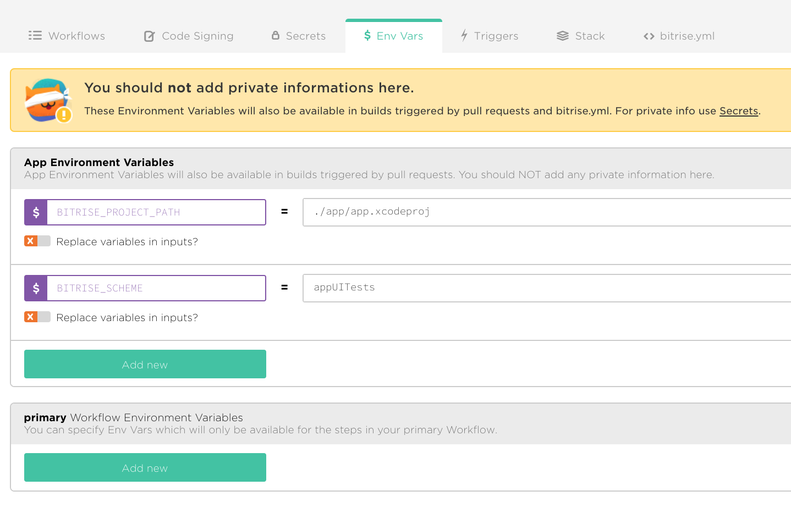
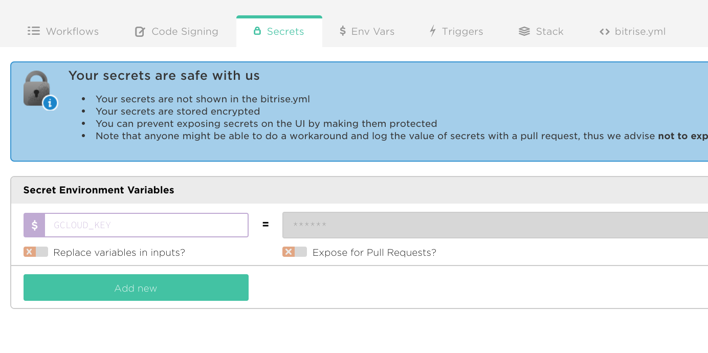
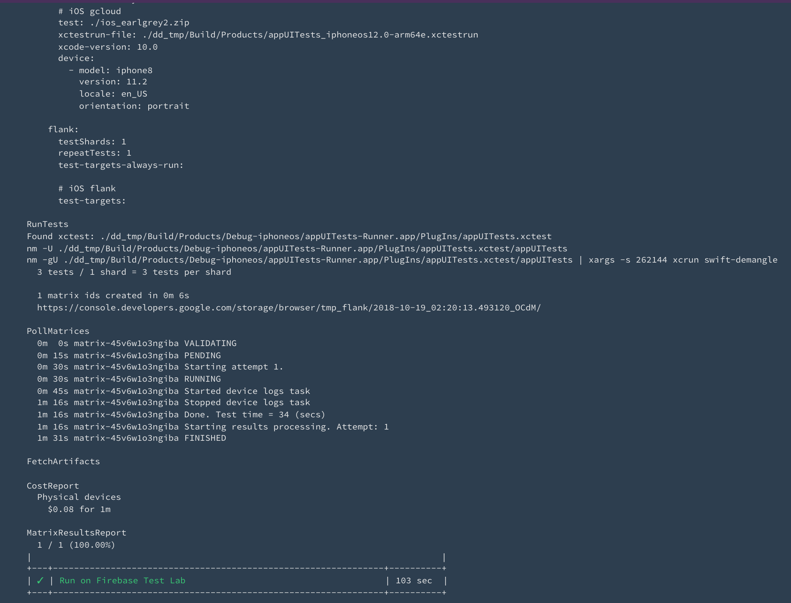

# EarlGrey 2 + Bitrise + Firebase Test Lab

Firebase Test Lab runs EarlGrey 2 tests built on Bitrise.

## Local execution on a local physical device

Clone the example repo to follow along.

```bash
$ git clone https://github.com/bootstraponline/earlgrey-2-binary-example.git
$ cd earlgrey-2-binary-example
```

After setting up EarlGrey 2 for an app, verify the tests run successfully locally on a real device:

```bash
./run_ftl_local.sh
```

```bash
#!/bin/bash

set -euxo pipefail

DD="dd_tmp"
SCHEME="appUITests"
ZIP="ios_earlgrey2.zip"

# Firebase test lab runs using -xctestrun
xcodebuild test-without-building \
  -xctestrun $DD/Build/Products/*.xctestrun \
  -derivedDataPath "$DD" \
  -destination 'id=ADD_YOUR_ID_HERE'

# get device identifier in Xcode -> Window -> Devices and Simulators
```

## Local execution on a remote physical device

Next verify the tests pass on Firebase Test Lab. Define `flank.ios.yml` for the app:

```yaml
gcloud:
  xcode-version: 10.0
  test: ./ios_earlgrey2.zip
  xctestrun-file: ./dd_tmp/Build/Products/appUITests_iphoneos12.0-arm64e.xctestrun
  results-bucket: tmp_flank
  device:
  - model: iphone8
    version: 11.2
    orientation: portrait
    locale: en_US

flank:
  testShards: 1
  testRuns: 1
```
Setup a [service account](https://firebase.google.com/docs/test-lab/android/continuous) if you haven't already. Run the tests using [gcloud](https://cloud.google.com/sdk/gcloud/reference/alpha/firebase/test/ios/run).

- `gcloud alpha firebase test ios run flank.ios.yml:gcloud`

If successful, then run the tests using [Flank](https://github.com/TestArmada/flank). Flank is a [massively parallel test runner](https://medium.com/walmartlabs/flank-smart-test-runner-for-firebase-cf65e1b1eca7) that provides test sharding, cost estimation, and HTML reporting.

- `flank firebase test ios run`

## Remote execution on a remote physical device

Now that we've verified the tests run locally with `xcodebuild test-without-building` and remotely using `gcloud` & `flank`, we're ready to setup a Bitrise job. Create a new app on Bitrise.

Archive the app locally and run:

- `bash -l -c "$(curl -sfL https://raw.githubusercontent.com/bitrise-tools/codesigndoc/master/_scripts/install_wrap.sh)"`

Accept the defaults for the prompts. Say yes to uploading the provisioning profiles and certificates.

Base64 encode the service account JSON file and copy the result to the clipboard.

`openssl base64 -in $HOME/.config/gcloud/application_default_credentials.json | pbcopy`

In the Workflow Editor, select `Secrets` and define a new secret with the key `GCLOUD_KEY` and paste the encoded JSON for the value. Edit the secret and mark it protected.

Select the `Env Vars` tab and define the following `App Environment Variables`

- `BITRISE_PROJECT_PATH` = `./app/app.xcodeproj`
- `BITRISE_SCHEME` = `appUITests`

Next in the `Workflows` tab, add a `Script` step titled `Set FTL credential` with the following contents:

```bash
#!/usr/bin/env bash
set -e

GCLOUD_DIR="$HOME/.config/gcloud/"
mkdir -p "$GCLOUD_DIR"
echo "$GCLOUD_KEY" | base64 --decode > "$GCLOUD_DIR/application_default_credentials.json"
```

Add a `Certificate and profile installer` step.

Add a `Build for FTL` step with:

```bash
#!/usr/bin/env bash
set -ex

./build_ftl.sh
```

The contents of `build_ftl.sh` are:

```bash
#!/bin/bash

set -euxo pipefail

if ! [ -x "$(command -v xcpretty)" ]; then
  gem install xcpretty
fi

DD="dd_tmp"
SCHEME="appUITests"
ZIP="ios_earlgrey2.zip"

rm -rf "$DD"

xcodebuild build-for-testing \
  -allowProvisioningUpdates \
  -project ./app/app.xcodeproj \
  -scheme "$SCHEME" \
  -derivedDataPath "$DD" \
  -sdk iphoneos \
  | xcpretty

pushd "$DD/Build/Products"
zip -r "$ZIP" *-iphoneos *.xctestrun
popd
mv "$DD/Build/Products/$ZIP" .
```

Add a `Script` step titled `Download Flank` with:

```bash
#!/usr/bin/env bash
set -ex

wget --quiet https://github.com/TestArmada/flank/releases/download/flank_snapshot/flank.jar -O ./flank.jar
```

Add a `Script` step titled `Run on Firebase Test Lab` with:

```bash
#!/usr/bin/env bash
set -ex

java -jar ./flank.jar firebase test ios run
```

Add a `Script` step titled `Copy results/` with:

```bash
#!/usr/bin/env bash
set -e

echo "Copying flank results to deploy dir"
cp -r ./results/*/* $BITRISE_DEPLOY_DIR
```

Finally, add a Deploy to Bitrise.io step.






<details>
  <summary>Click to display the complete bitrise.yml</summary>

```yaml
---
format_version: '6'
default_step_lib_source: https://github.com/bitrise-io/bitrise-steplib.git
project_type: other
trigger_map:
- push_branch: "*"
  workflow: primary
- pull_request_source_branch: "*"
  workflow: primary
workflows:
  primary:
    steps:
    - activate-ssh-key:
        run_if: '{{getenv "SSH_RSA_PRIVATE_KEY" | ne ""}}'
    - git-clone: {}
    - script:
        title: Set FTL credential
        inputs:
        - content: |
            #!/usr/bin/env bash
            set -e

            GCLOUD_DIR="$HOME/.config/gcloud/"
            mkdir -p "$GCLOUD_DIR"
            echo "$GCLOUD_KEY" | base64 --decode > "$GCLOUD_DIR/application_default_credentials.json"
    - certificate-and-profile-installer: {}
    - script:
        inputs:
        - content: |-
            #!/usr/bin/env bash
            set -ex

            ./build_ftl.sh
        title: Build for FTL
    - script:
        inputs:
        - content: |-
            #!/usr/bin/env bash
            set -ex

            wget --quiet https://github.com/TestArmada/flank/releases/download/flank_snapshot/flank.jar -O ./flank.jar
        title: Download Flank
    - script:
        title: Run on Firebase Test Lab
        inputs:
        - content: |-
            #!/usr/bin/env bash
            set -ex

            java -jar ./flank.jar firebase test ios run
    - script:
        title: Copy results/
        inputs:
        - content: |-
            #!/usr/bin/env bash
            set -e

            echo "Copying flank results to deploy dir"
            cp -r ./results/*/* $BITRISE_DEPLOY_DIR
    - deploy-to-bitrise-io: {}
app:
  envs:
  - opts:
      is_expand: false
    BITRISE_PROJECT_PATH: "./app/app.xcodeproj"
  - opts:
      is_expand: false
    BITRISE_SCHEME: appUITests
```
</details>
