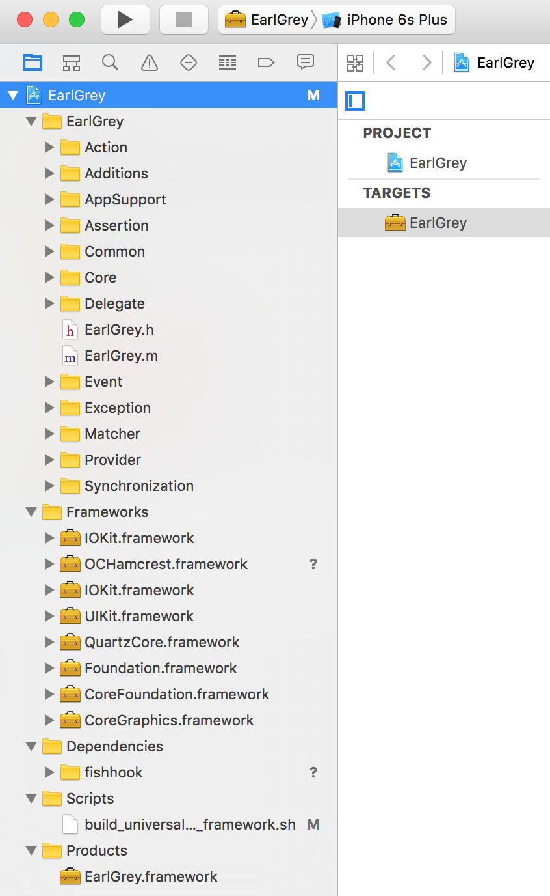

# Install and run

This document shows you how to install EarlGrey and then how to set up and run your first
test.

## Prerequisites

For EarlGrey to function properly, make sure the app under test has correct launch screen images present for all supported devices (see [iOS Developer Library, Launch Files](https://developer.apple.com/library/ios/documentation/UserExperience/Conceptual/MobileHIG/LaunchImages.html)).

## Install EarlGrey

You can add EarlGrey to Xcode projects in two ways: using CocoaPods, or as a framework. If you wish to contribute to the EarlGrey project, the **EarlGrey.xcodeproj** generated from the [GitHub Installation](#github-installation) section is integrated with the Unit and Functional Test projects for you to work with the source.

### CocoaPods installation

For EarlGrey, we highly recommend [CocoaPods](https://cocoapods.org/) as the best way to get started.

#### Step 1: Set up a test target

  1. EarlGrey requires a **Test Target**. Because EarlGrey adds changes to the test target's Scheme and Build
  Phases, we recommend that you create a separate test target for adding EarlGrey tests. If you do not have
  one set up already, you can do so by selecting your project in the Xcode Project Navigator, and then and
  clicking **Editor → Add Target...** from the menu.
  2. In the **Add Target** window, select **iOS** → **Test** → **iOS Unit Testing Bundle**:

      

  3. Because EarlGrey uses Schemes, the test target must have a Scheme associated with it. It is also
  better if the Scheme is shared. If your test target does not have a Scheme, go to **Product** → **Scheme** → **Manage Schemes**, press
  the plus **(+)** sign, and then select the target from the dropdown menu. Select the **Shared** option and
  have the **Container** set to the app under test.

    

     Note: If you recently created the Schemes, you need to run them once for them to be picked up by the
     `pod install` command. If your **Test Target(s)** do not contain these changes to the
     [Scheme](#scheme-changes) and [Build Phases](#build-phase-changes) after running
     `pod install`, please re-run `pod install` again.

#### Step 2: Add EarlGrey as a framework dependency

  1. After your test target (for example, *SampleAppTests*) is set up, you now need to add EarlGrey as
  a framework dependency. To do so, add EarlGrey as a dependency to the test target in your `Podfile`.
  2. Because EarlGrey must be embedded within the app under test, we need to add certain Build Phases and
  Scheme changes to the **Test Target**. We recommend using our earlgrey gem to install any dependencies. You can use it by running `gem install earlgrey`. In case you are using an earlier version of the EarlGrey CocoaPod, please peruse this [doc](https://github.com/google/EarlGrey/tree/master/docs/versions.md) to find the corresponding EarlGrey gem version and any syntax changes. To download a particular version of the gem, use `gem install earlgrey -v x.y.z`.

  You need to require this gem in a post_install hook using the project's name, the test target's name, and the name of the xcscheme file as is shown in the below example for `1.0.0`:

  ```ruby
  PROJECT_NAME = 'SampleApp'
  TEST_TARGET = 'SampleAppTests'
  SCHEME_FILE = 'SampleAppTests.xcscheme'

  target TEST_TARGET do
    project PROJECT_NAME

    use_frameworks!
    inherit! :search_paths
    pod 'EarlGrey'
  end

  post_install do |installer|
    require 'earlgrey'
    configure_for_earlgrey(installer, PROJECT_NAME, TEST_TARGET, SCHEME_FILE)
  end
  ```

    The earlgrey gem is supported with CocoaPods 1.0.0 and beyond. For earlier versions (or if you don't want a gem dependency) replace `require 'earlgrey'` with `load 'configure_earlgrey.rb'` and manually copy `configure_earlgrey.rb` from the gem into the same directory as the `Podfile`.

   * For multiple targets and Schemes, call the `configure_for_earlgrey` method for each target / Scheme.
   * The `:exclusive => true` and `inherit! :search_paths` flag prevents double-linking for libraries in the test target with any conflicting libraries in the main application.
   * Please ensure you use `use_frameworks!` if you wish to run EarlGrey in a Swift Test Target. This is not required if you're running EarlGrey in an Objective-C Test Target.
   * For more information, visit the [CocoaPods Podfile Guide](http://guides.cocoapods.org/using/the-podfile.html).
   * If you don't want a gem dependency, replace `require 'earlgrey'` with `load 'configure_earlgrey.rb'` and manually
     copy `configure_earlgrey.rb` from the gem into the same directory as the Podfile.

#### Step 3: Run the pod install command

After you successfully run the `pod install` command, open the generated workspace and find EarlGrey installed in the `Pods/` directory. The generated `Pods/` project should look similar to:

  

### Carthage Installation

EarlGrey supports Carthage via the [EarlGrey gem.](https://rubygems.org/gems/earlgrey)

#### Step 1: Set up a test target for Carthage

Follow [Step 1 from `CocoaPods installation`](#step-1-set-up-a-test-target) detailed above.

#### Step 2: Configure Carthage

  1. Install carthage.

    `brew update; brew install carthage`

  2. Specify the version of EarlGrey to use in Cartfile.private.
     Note that you can also use "master" instead of a release tag.

    `echo 'github "google/EarlGrey" "1.2.0"' >> Cartfile.private`

  3. Update to latest EarlGrey revision and create Cartfile.resolved.

    `carthage update EarlGrey --platform ios`

#### Step 3: Complete installation

  1. Install the EarlGrey gem.

    `gem install earlgrey`

  2. Use the gem to install EarlGrey into the testing target.

    `earlgrey install -t EarlGreyExampleSwiftTests`

Now you're ready to start testing with EarlGrey!
If you need more control, review the available install options.
`earlgrey help install`

### GitHub Installation

In cases where neither CocoaPods nor Carthage is compatible with your project, you can add EarlGrey manually to your Xcode project.

#### Step 1: Generate EarlGrey.framework

  1. Download the source for EarlGrey and its dependencies.
     * Download EarlGrey's source code from the [Latest Release](https://github.com/google/EarlGrey/archive/1.0.0.zip)

     * Unzip and go to the `EarlGrey-1.0.0/EarlGrey` directory that contains **EarlGrey.xcodeproj**.

     * Open the **EarlGrey.xcodeproj** file and build the EarlGrey scheme.

      Your EarlGrey folder structure should now look like this:

      

      And your EarlGrey Project should look like this:

      

  2. As part of the initial build step, a script **setup-earlgrey.sh** will be run to download all the required dependencies. Without it, you might find dependencies like `fishhook` and `OCHamcrest` shown as missing in the folder structure.

#### Step 2: Add EarlGrey as a dependency of the project which contains your app under test

  1. Close **EarlGrey.xcodeproj** so that it is no longer open in any Xcode window. Once closed, drag **EarlGrey.xcodeproj** from its directory into your App’s project or workspace in Xcode. To verify this, you should find `EarlGrey` in the list of targets of your app in Xcode:

      

  2. Add **EarlGrey.framework** as a dependency of your project’s Test Target:

    ```
    Project → Test Target → Build Phases → Link Binary With Libraries → + (Add Sign) → EarlGrey.framework`
    ```

  3. Add EarlGrey as a Target Dependency to the Test Target:

    ```
    Project → Test Target → Build Phases → Target Dependencies → + (Add Sign) → EarlGrey
    ```

     The Test Target’s Build Phases should now look similar to this:

     

  4. Turn off Bitcode as it is not supported by EarlGrey (yet) by setting **Enable Bitcode** to **NO** in the Build Settings of the Test Target.

  5. You must add environment variables in the Test Target's Scheme to inject the EarlGrey framework. To do so, go to **The Test Target → Edit Scheme → Test Action** and then deselect **Use the Run action's arguments and environment variables**. Add the following details in the `Environment Variables`:

           Key: `DYLD_INSERT_LIBRARIES`
           Value:`@executable_path/EarlGrey.framework/EarlGrey`

     Make sure the `Expand Variables Based On` value points to the app under test. The Scheme should now look like this:<a name="scheme-changes"></a>

    

#### Step 3: Attempt to build the app under test

In Xcode, attempt to build the app under test. It should build without any errors. After EarlGrey is built, see the [Final Test Configuration](#final-test-configuration) section for additional customizations that you may need to get your tests to run.

#### Final Test Configuration <a name="final-test-configuration"></a>

The EarlGrey tests are hosted from the application being tested. Make sure the test target is setup
correctly to launch the app under test:

1. Under the **General** tab:
   * **Host Application** is set to the app under test.

2. Under the **Build Settings** tab:
   * **Test Host** points to your application, for example:
   *$(BUILT_PRODUCTS_DIR)/<PRODUCT_NAME>.app/<PRODUCT_NAME>* where
   *<PRODUCT_NAME>* must be replaced by the name of the app under test.
   * **Bundle Loader** is set to *$(TEST_HOST)*.
   * **Wrapper Extension** is set to *xctest*.
3. Add a **Copy Files** Build Phase to the Test Target to copy the EarlGrey framework to your app under test.
To do this, choose **Project → Test Target → Build Phases → + (Add Sign) → New Copy Files Phase**, and then
add the following details in the **Copy Files** phase:

           Destination: `Absolute Path`
           Path: `$(TEST_HOST)/..`
           Copy files only when installing: Deselect
           Name: `Path to EarlGrey.Framework` with `Code Sign on Copy` selected.

   The Build Phases should now include:<a name="build-phase-changes"></a>

    

After the app under test is set up, you can use the Xcode **Test Navigator** to add new test classes and run them selectively, or together.

## Set Up and run your first test

Because EarlGrey is based on XCTest, creating your first test in Xcode is as easy as creating a new
**Unit Test Case Class**. Be careful not to confuse **Unit Test Case Class** with **UI Test Case
Class**. **UI Test Case Class** uses the new UI Testing feature added to XCTest and isn’t yet
compatible with EarlGrey.

1. **Ctrl+Click** the folder for your app's source files, and then select **New file...**. The
following dialog will appear:

   

2. Select **Unit Test Case Class**, and then click **Next**. On the following screen, type the name
of your test case. For this example, let’s leave it as *MyFirstEarlGreyTest*:

   

3. On the next screen, make sure that the test is associated with the Unit Test target. In this
case, our target is *SimpleAppTests*:

   

4. Xcode will create a new test case for us but we won’t need much of it. Let’s change the code to
leave just a single test method and include the EarlGrey framework, like this:

   ```objc
   @import EarlGrey;
   #import <XCTest/XCTest.h>

   @interface MyFirstEarlGreyTest : XCTestCase
   @end

   @implementation MyFirstEarlGreyTest

   - (void)testExample {
     // Your test actions and assertions will go here.
   }

   @end
   ```

5. Now let’s add a simple EarlGrey assertion that checks for the presence of a key window and
asserts that it is displayed. Here’s what the resulting test would look like:

   ```objc
   - (void)testPresenceOfKeyWindow {
     [[EarlGrey selectElementWithMatcher:grey_keyWindow()]
         assertWithMatcher:grey_sufficientlyVisible()];
   }

   ```

6. And that’s it! As with any other unit test, this test will show up in the test navigator, so you
can run it by just clicking on the **run** icon or by Ctrl+clicking the test name and then selecting
**Test "testPresenceOfKeyWindow"**. Because this is a regular unit test, you can place breakpoints in
your test and in your application code and use the built-in tools seamlessly.

### Swift

If you want to write your test cases in Swift, you need to perform two additional
steps in your setup:

1. Include the `EarlGrey.swift` file in your Swift Test Project. The file contains functions that
   implement C preprocessor macros that aren't available in Swift.

  * **If you're using the [earlgrey gem](https://rubygems.org/gems/earlgrey)**

      The EarlGrey gem also copies the `EarlGrey.swift` file to your project directory if you're passing the
      `{swift: true}` parameter to the args for the `configure_for_earlgrey()` method as in the below snippet.
      You need to manually link this file to your project.

      ```ruby
      configure_for_earlgrey(installer, PROJECT_NAME, test_target, test_target + '.xcscheme', {swift: true})
      ```

      EarlGrey currently supports Swift 3.0 and 2.3. While 3.0 is the default, you can also use 2.3 by adding
      `{swift: true, swift_version: 2.3}`.

  * **Manual installation without the [earlgrey gem](https://rubygems.org/gems/earlgrey)**

      In this case you need to download the correct
      [`EarlGrey.swift`](https://github.com/google/EarlGrey/tree/master/gem/lib/earlgrey/files/) file
      for your Swift version and add it to your test bundle.

Here is an example of a very basic EarlGrey test written in Swift:

```swift
import EarlGrey

 // Select the button with Accessibility ID "clickMe" and assert it's visible.
 EarlGrey.select(elementWithMatcher: grey_accessibilityID("ClickMe"))
   .assert(grey_sufficientlyVisible())
```

> For compatibility with Swift, we use `grey_allOfMatchers()` and `grey_anyOfMatchers()` instead of `grey_allOf()`
and `grey_anyOf()` respectively.
