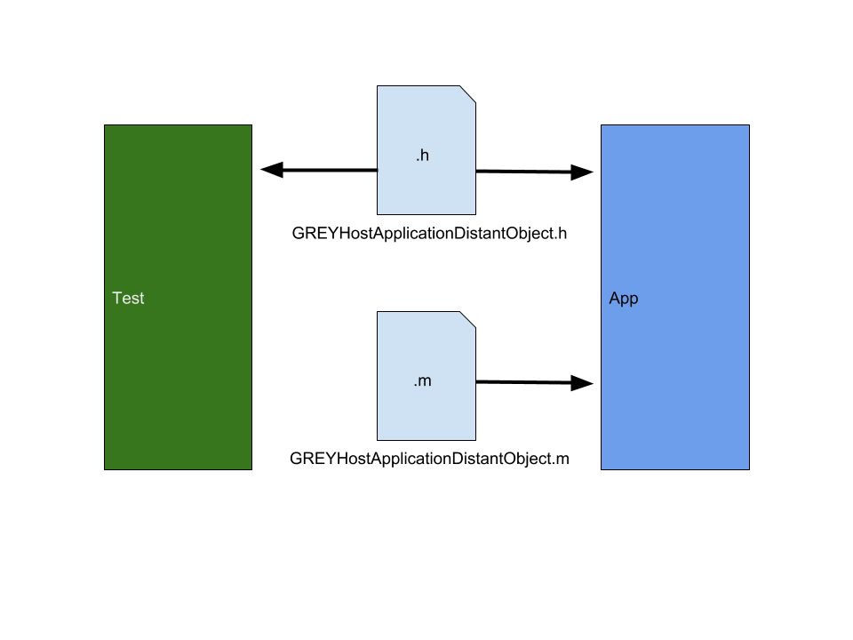

# How to Query / Modify the Application Under Test (White-Boxing) in Objective-C

In Objective-C, using the Helper Bundle is quite straightforward. As mentioned,
you just need to have categories for the Distant Objects which proxy calls from
the tests to the application. For Objective-C, the categories must be part of
the application, with the headers exposed to the tests. This is achieved with
the Helper Bundle.

If the Helper Bundle was set up as mentioned, on running the test, it will now
be embedded into the application under test. Please add the `User Header Search
Paths` of the Helper Bundle to your **Test Target** so that the headers are
available in the test.



### GREYHostApplicationDistantObject (Main Thread)

To get setup, say you wish to get the status bar orientation of the application
under test. Since it's a UIKit change, this requires to be done on the main
thread of the application. Let's use GREYHostApplicationDistantObject to achieve
this. Create a simple category interface for GREYHostApplicationDistantObject.
Add this header to both the Test Component and the Helper Bundle.

```objectivec
File: GREYHostApplicationDistantObject+AppOrientation.h

#import <UIKit/UIKit.h>

#import "CommonLib/DistantObject/GREYHostApplicationDistantObject.h"

@interface GREYHostApplicationDistantObject (AppOrientation)

/**
 *  @return The UIInterfaceOrientation of the app under test.
 */
- (UIInterfaceOrientation)appOrientation;

@end
```

Now add the implementation. The code here will be run in the application
process. Add this only to the Helper Bundle.

```objectivec
File: GREYHostApplicationDistantObject+AppOrientation.m

#import "GREYHostApplicationDistantObject+AppOrientation.h"

@implementation GREYHostApplicationDistantObject (AppOrientation)

- (UIInterfaceOrientation)appOrientation {
  return [[UIApplication sharedApplication] statusBarOrientation];
}

@end
```

You can now use this in your tests as:

```objectivec

#import "GREYHostApplicationDistantObject+AppOrientation.h"

- (void)testInterfaceOrientation {
  [[GREYHostApplicationDistantObject sharedInstance] appOrientation];
}

```

### GREYHostBackgroundDistantObject (Background Thread)

Not all tasks need to be performed on the main thread. Since the test and app
process are separate now, we can leverage this to send actions from the test
process that can be performed on a background thread and don't necessarily need
blocking the main thread. Here's a trivial example of something like this being
done.

```objectivec
File: GREYHostBackgroundDistantObject+UpdateValue.h

#import <UIKit/UIKit.h>

#import "CommonLib/DistantObject/GREYHostBackgroundDistantObject.h"

@interface GREYHostBackgroundDistantObject (UpdateValue)

/**
 *  Increments an integer value by 1 and returns it.
 */
- (int)incrementValue:(int)value;

@end

File: GREYHostBackgroundDistantObject+UpdateValue.m

#import "GREYHostBackgroundDistantObject+UpdateValue.h"

@implementation GREYHostBackgroundDistantObject (UpdateValue)

- (int)incrementValue:(int)value {
  return value + 1;
}

@end
```

You can now use this in your tests as:

```objectivec

#import "GREYHostBackgroundDistantObject+UpdateValue.h"

- (void)testInterfaceOrientation {
  [[GREYHostBackgroundDistantObject sharedInstance] incrementValue:3];
}

```
