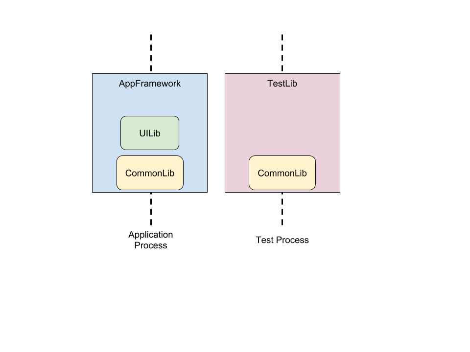
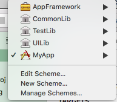
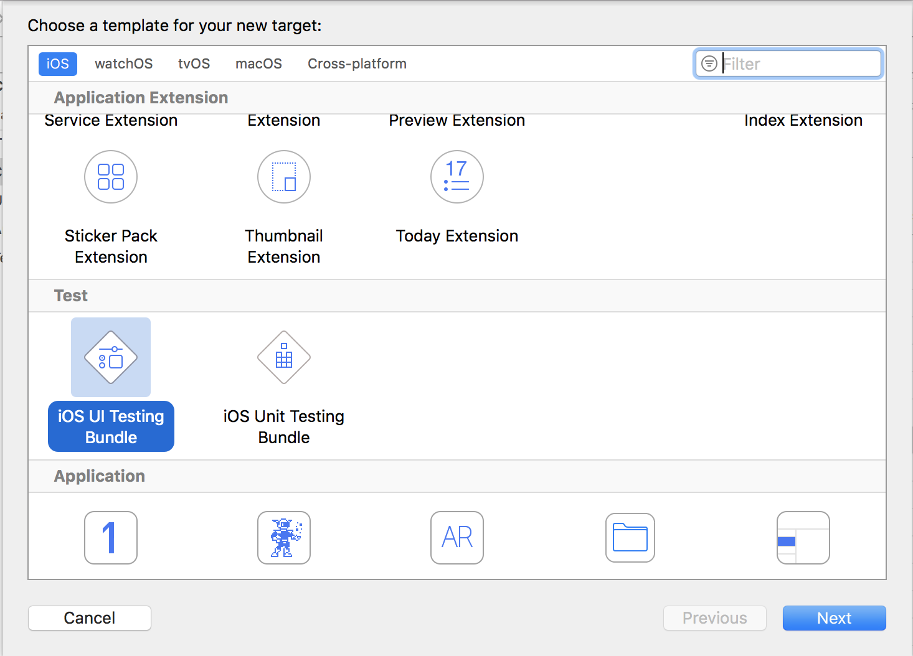
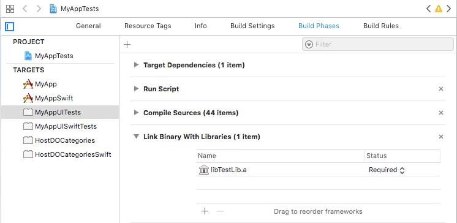
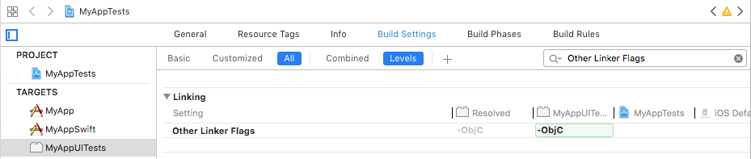
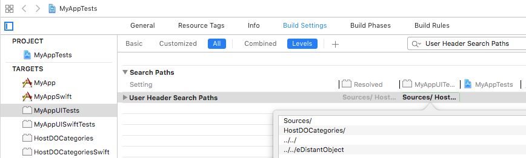
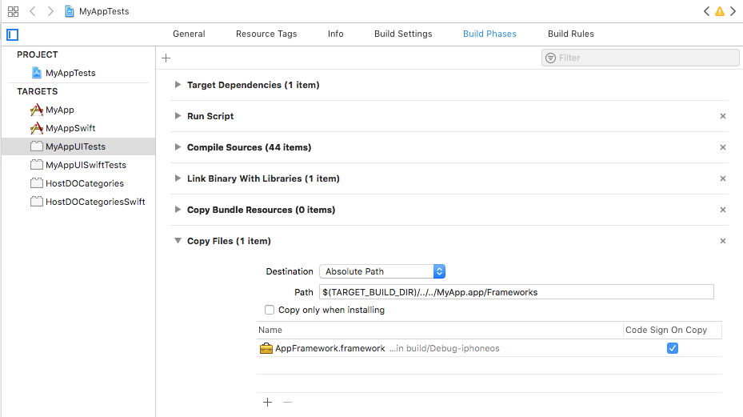
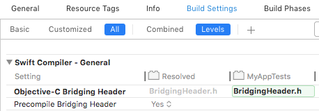

**Note:** We're releasing the EarlGrey 2.0 source code with Xcode Project Integration
as of now. The open-source version is currently in Beta. As we proceed over the
coming quarters, we'll add support for CocoaPods and Carthage as well. Please
peruse the code and do bring forward any issues or concerns you might have with
migrating your EarlGrey 1.0 tests to 2.0. We're looking forward to provide
improvements over the following quarters.

# Using EarlGrey 2.0

EarlGrey 2.0 uses XCUITest which runs tests in a separate process than the
application. As a result of this, we need to have two different EarlGrey
components - one for the test and one for the application. On opening the
[EarlGrey.xcodeproj](../EarlGrey.xcodeproj) file, you will find four components -

*   **CommonLib** - A static library containing sources that will be linked into
    both the test and app process.
*   **UILib** - A static library containing utilities for performing UI checks
    such as visibility checks, screenshots, traversing the hierarchy.
*   **TestLib** - A static library containing Test Component utilities and
    additions for EarlGrey. Also contains Distant Objects that tunnel calls from
    the test to the application process. **This must be linked to the test
    target.**
*   **AppFramework** - A framework that contains App Component EarlGrey sources
    related to synchronization, actions, and assertions. Also contains
    DistantObject utilities for transporting errors etc. back to the test for
    reporting.

  These components are structured in the following way for the application component
  and the test component.



## 1. Steps to add EarlGrey 2.0 to your tests using Xcode

**Note:** We plan to add CocoaPods support for EarlGrey support in the coming
quarters.

Clone the EarlGrey project to your workspace.

```
// Clone EarlGrey 2.0
git clone -b earlgrey2 https://github.com/google/EarlGrey.git

// Download any dependencies. Run this command from the EarlGrey/ root directory
// as it will download the submodule relative to the location it was called in.
sh Scripts/download_deps.sh
```

On doing so, your folder structure inside the EarlGrey repository should look
like the following:

```
AppFramework/
CommonLib/
TestLib/
UILib/
Tests/
fishhook/
eDistantObject/
README.md
LICENSE
EarlGrey.xcodeproj
```

Open the `EarlGrey.xcodeproj` file and ensure that the `AppFramework` and the `TestLib` target
build.



Add the `EarlGrey.xcodeproj` file to your project's Xcode. This is as simple as
a drag and drop inside your Xcode Project. Make sure it is inside your project target
and not outside it (doing the latter will make Xcode ask you to create a workspace).
Ensure that the EarlGrey targets are now present in your list of targets. In case any
of the newly added projects are greyed out, please close any open Xcode Projects
and re-open your test project.

### 1. Creating a UI Test Target

To create a UI test target, go to `File >> New >> Target >> iOS >> UITesting
Bundle`



You should now have a simple plain XCUITest available. In the following steps,
we will integrate EarlGrey 2.0 with it.

### 2. Test Component

1.  In the `Build Phases` of your test target, add `libTestLib.a` into the "Link
    Binary With Libraries" section.
    

2.  In `Build Settings` add `-ObjC` to `Other Linker Flags` to load all the
    TestLib symbols in your tests. 

3.  Add the `User Header Search Paths` for the EarlGrey directory (**the
    directory containing the EarlGrey.xcodeproj**) and the eDistantObject
    directory (**the directory containing the eDistantObject.xcodeproj**) so all
    the headers can be accessed. 

### 3. App Component

The App Component of EarlGrey 2.0 is a framework which allows you to dynamically
inject it into your application. For the dynamic injection, we have to use the
**UI Test Target** to inject it into the Application. So, go to the Build Phases
of your UI Test Target:

*   In Build Phases, Click on the (+) sign at the top and select `New Copy Files
    Phase`. In the new Copy Files Phase that is added, add the following
    information:
    *   Destination: `Absolute Path`
    *   Path:
        `$(TARGET_BUILD_DIR)/../../<YOUR_APPLICATION_TARGET_NAME.app>/Frameworks`
    *   Uncheck `Copy only when installing`
    *   Click on the (+) in the bottom and add AppFramework.framework. Select
        `Code Sign On Copy`



Make sure your test target builds fine and that's it! You're ready to write your
first test now!

## 2. Basic EarlGrey 2.0 Test

For EarlGrey 2.0 to work with XCUITest, AppFramework.framework needs to be
dynamically loaded into the application under test. We have added code to do so
within EarlGrey's AppFramework component so you don't need to. If you've
finished the Copy Files Script work above, then the following code should run
fine for you now.

```objective-c
#import <XCTest/XCTest.h>

#import "TestLib/EarlGreyImpl/EarlGrey.h"

@interface FirstEarlGreyV2Test : XCTestCase
@end

@implementation FirstEarlGreyV2Test

- (void)testIfKeyWindowIsPresent {
  // XCUITest Setup
  XCUIApplication *application = [[XCUIApplication alloc] init];
  [application launch];

  // EarlGrey Statement
  [[EarlGrey selectElementWithMatcher:grey_keyWindow()] performAction:grey_tap()];
}

@end
```

## 3. Swift Support

The setup of the project is exactly the same for Swift tests as it is for an
Objective-C one, down to the `User Header Search Paths`. The only addition that
you need to make is adding the [EarlGrey.swift](../TestLib/Swift/EarlGrey.swift)
wrapper that provides a Swift-only interface for EarlGrey 2.0 to your test
target.

#### Bridging Header

Since EarlGrey 2.0's Test component is a Library, you need to add a Bridging
Header to ensure `EarlGrey.swift` compiles.

Please create a Bridging Header for your Swift Test Target.



Add the following imports:

```objective-c
#import "AppFramework/Action/GREYAction.h"
#import "AppFramework/Action/GREYActionBlock.h"
#import "AppFramework/Action/GREYActions.h"
#import "CommonLib/DistantObject/GREYHostApplicationDistantObject.h"
#import "CommonLib/Matcher/GREYElementMatcherBlock.h"
#import "CommonLib/Matcher/GREYMatcher.h"
#import "TestLib/AlertHandling/XCTestCase+GREYSystemAlertHandler.h"
#import "TestLib/EarlGreyImpl/EarlGrey.h"
```

If you need any more EarlGrey imports in your Swift tests, *add them in the briding
header*. This will get rid of any `undeclared type` warnings. For starting off, you
can add [EarlGreySwiftBridgingHeader.h](../TestLib/Swift/EarlGreySwiftBridgingHeader.h)
to your Test Component.

Just add this file to your Test Target. You don't need to import EarlGrey in
your test file. For loading the framework on a device, please add
`@loader_path/Frameworks` to your `Runpath Search Paths` for both the App and
Test Component.

The following code should work just fine now:

```swift
class MyFirstEarlGreyTest: XCTestCase {

  func testExample() {
    let application: XCUIApplication = XCUIApplication()
    application.launch()
    EarlGrey.selectElement(with: grey_keyWindow())
      .perform(grey_tap())
  }
}
```

### More Details

For more details about the setup, take a look at the EarlGrey 2.0
[FunctionalTests](../Tests/FunctionalTests/docs/setup.md) Project. To get
started with making white-box calls, take a look at this doc:

*   [White-Boxing Pre-requisites](white-boxing-setup-guide.md)
