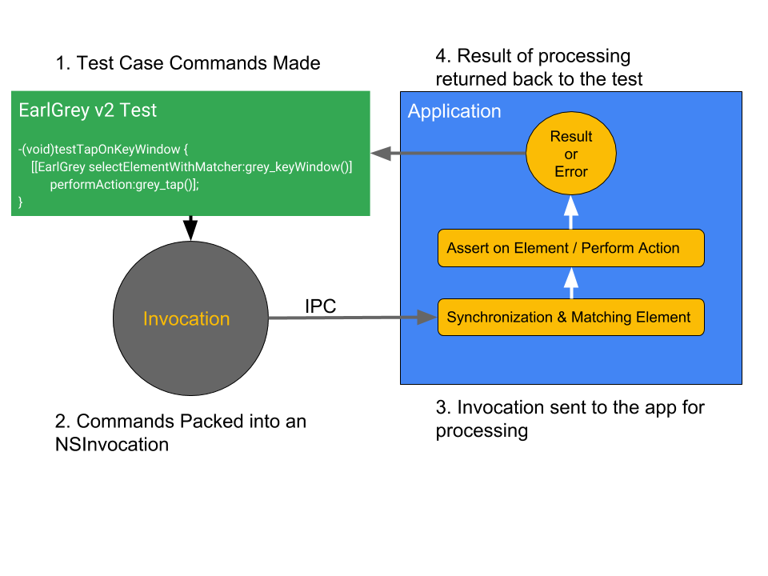
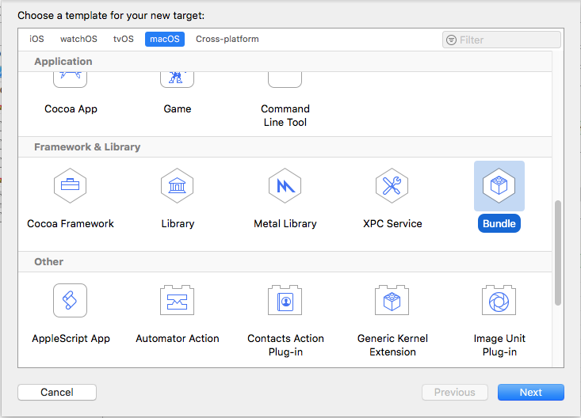
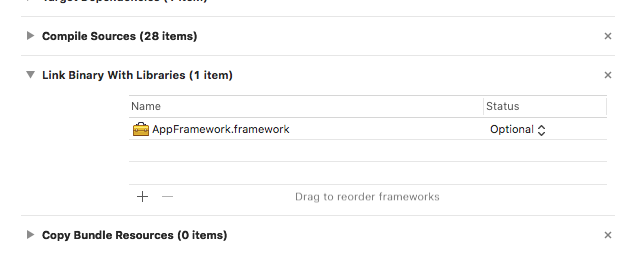
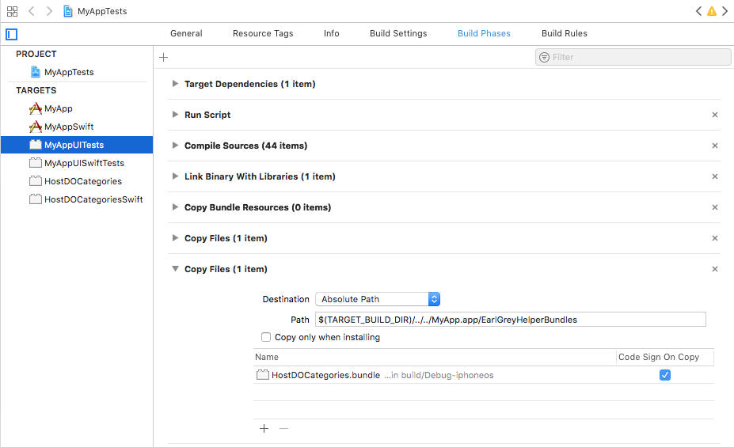
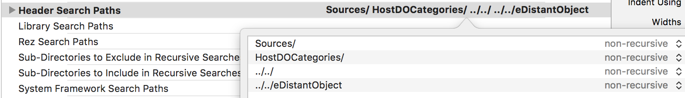

# How to Query / Modify the Application Under Test (White-Boxing)

First, let's understand what EarlGrey 2.0 is -

EarlGrey 2.0 works with XCUITest, which enforces that the test and application
are separate processes. This means that barring using XCUITest APIs to interact
with the UI layer, you cannot perform any query on the application under test.
EarlGrey 2.0 gets around this limitation by using its own IPC mechanism called
[eDistantObject (eDO)](https://github.com/google/eDistantObject). Using this,
all existing EarlGrey interactions work just fine, but for customizing your
interactions, you will need a bit more work as we will cover in this guide.

At a higher level, this is how EarlGrey 2.0 works -

The test statement is packaged into an NSInvocation, sent to the application and
then processed.

Similarly, as a user, you can leverage eDO to send calls across the test to the
app as well. This is done with the help of `GREYHostApplicationDistantObject`
and `GREYHostBackgroundDistantObject`, both of which are provided to you by
EarlGrey 2.0.

To directly modify or talk to objects and classes in the application, we provide
you two distant objects -

`GREYHostApplicationDistantObject` - Runs on the main thread of the application
under test. `GREYHostBackgroundDistantObject` - Runs on a background thread of
the application under test.

To leverage them, you need to carry out the following:

### Setup a Helper Bundle

We need to have a bundle that we can embed into the application and then load it
using EarlGrey's app component. To create a bundle, perform the following steps:

*   In Xcode, go to File >> New >> Target.
*   In the window that comes up, select Bundle.

*   On the new bundle being created, go to the target's Build Settings and
    change the following:

    *   **Base SDK**: Latest iOS
    *   **Other Linker Flags**: Add `-ObjC` to ensure all categories are loaded.
    *   **Bundle Loader**: Make this point to your application's executable. For
        eg. For the FunctionalTests project, we have this set to
        `$(TARGET_BUILD_DIR)/FunctionalTestRig.app/FunctionalTestRig`. Replace
        `FunctionalTestRig` with your own app's name.
    *   **User Header Search Paths**: Make sure the directory in which
        `EarlGrey.xcodeproj` and `eDistantObject.xcodeproj` are is added here
        along with any other Headers needed for compilation.
    *   (Swift Only)**RunPath Search Paths**: `@loader_path/Frameworks` To
        ensure Swift frameworks are loaded.

*   Now, in the Build Phase, add a Target Dependency on the `Application Under
    Test`. This is needed because the application and it's symbols need to be
    present for the Bundle to compile. In `Link Binary With Libraries`, add a
    dependency on `AppFramework.framework` and set the `Status` to **Optional**.
    This is important because any libraries that are part of the Helper Bundle
    have to only be **Weakly Linked**. Add similar dependencies for any other
    Symbols you're using for any custom code in the Helper Bundle. Also add the
    right `User Header Search Paths` to the Bundle.

If you build the Helper Bundle now, it should successfully build. To take a look
at how to create one, take a look at `HostDOCategories` for Objective-C and
`HostDOCategoriesSwift` for Swift in our
[Functional Tests project](../Tests/FunctionalTests/FunctionalTests.xcodeproj).

### Embed the Bundle into your application under test

If you recall, in the [App Component Setup Section](setup.md#3-app-component) in
the Basic Setup doc, we mentioned how a user needs to inject EarlGrey's
AppFramework into the application udner test using a Copy Files Script. To
inject the Helper Bundle, you need to do something similar but with a minor
tweak.

*   In your test target's Build Phases, Click on the (+) sign at the top and
    select `New Copy Files Phase`. In the new Copy Files Phase that is added,
    add the following information:
    *   Destination: `Absolute Path`
    *   Path:
        `$(TARGET_BUILD_DIR)/../../<YOUR_APPLICATION_TARGET_NAME.app>/EarlGreyHelperBundles`
    *   Uncheck `Copy only when installing`
    *   Click on the (+) in the bottom and add the created Helper Bundle. Select
        `Code Sign On Copy`

**Note:** Please ensure that the final directory in the path is
**`EarlGreyHelperBundles`**. The EarlGrey app component automatically loads all
NSBundles under this directory for usage with EarlGrey.

### Expose the Headers of the Helper Bundle to the Test Target

In your Test Target, expose the Headers of the Helper Bundle by adding the path
of the sources inside it to the `User Header Search Paths` of the Tests.

At the end of this step, you should be able to run a basic test. You can create
categories on `GREYHostApplicationDistantObject` and
`GREYHostBackgroundDistantObject` to tunnel calls to the application under test.

### Querying / Modifying the Application Under Test

Now that you have everything set up, look at the following language specific doc
for how to query / modify the application under test:

*   [Objective-C](objective-c-white-boxing.md)
*   [Swift](swift-white-boxing.md)
